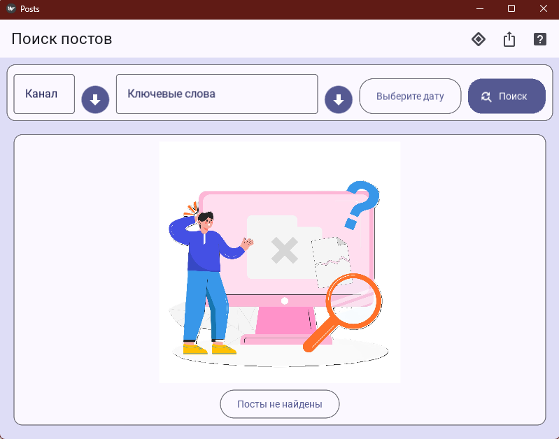

# Telegram Post Searcher App

[](https://docs.python.org/3/whatsnew/3.11.html)
[](https://rdxhtmlexperienceblob.z20.web.core.windows.net/holiday-2022/staging/modern-life/#/welcome)
[](https://core.telegram.org/)
[](https://www.microsoft.com/en-us/microsoft-365/word)

This application integrates Telegram automation with a KivyMD-based GUI.



## Installation

1. **Install [Python](https://www.python.org/downloads/), [Git](https://git-scm.com/downloads) for Windows and clone the repository.**

2. **Install dependencies:**
    - [Telethon](https://github.com/LonamiWebs/Telethon)
    - [KivyMD 2.0 (from GitHub)](https://github.com/kivymd/KivyMD)
    - [Pyperclip](https://github.com/asweigart/pyperclip)

    ```bash
    python -m venv venv
    venv\Scripts\activate.bat
    pip install telethon pyperclip
    pip install git+https://github.com/kivymd/KivyMD.git@master
    ```

3. **Install [Microsoft Office](https://www.microsoft.com/en/microsoft-365?market=af).**  
    Ensure Microsoft Office is installed on your system.

## Getting Started

1. **Get Telegram API credentials:**
    - Register at [my.telegram.org](https://my.telegram.org).
    - Obtain your **API ID** and **API Hash**.

2. **Run the app:**
    - Start the GUI with:
      ```
      run.bat
      ```
    - In the app settings, enter your Telegram API ID, API Hash.

3. **Authenticate with Telegram:**
    - Run:
      ```
      python single_run.py
      ```
    - Follow the prompts to authenticate your Telegram account.

4. **Start using the app:**
    - Launch the app again with:
      ```
      run.bat
      ```
    - Begin your search or automation tasks.

## Notes

- Make sure all dependencies are installed in your Python environment.
- For any issues, check the documentation of each dependency.